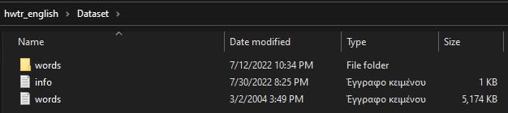
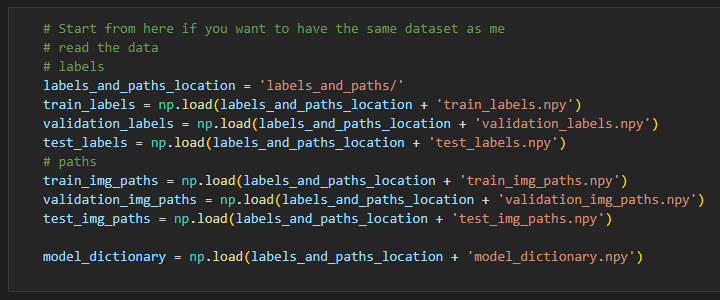
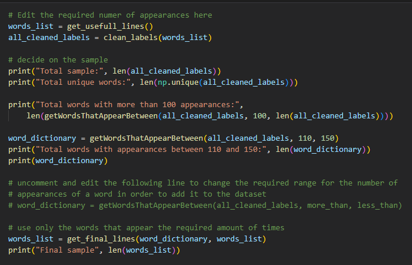
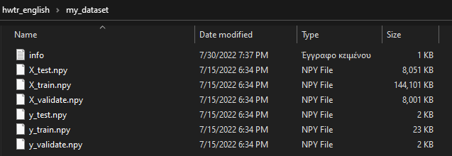

# Hand Written Text Recognition (for English)

### Description
This is part of my master thesis titled "Recognition Of Handwritten Text With The Use Of Machine Learning" (Original tiltle in Greek: "Αναγνώριση Χειρόγραφου Κειμένου Με Χρήση Μηχανικής Μάθησης") for the University of Patras.

The code in this repository reflects my thought process for finding an optimal neural network. The neural network that I found that it works best with the part of the dataset that I used has the following characteristics:  

<u>**Input layer**</u>  
- 2D convolutional layer 
- 48 nodes
- 0.25 dropout

<u>**Hidden layers**</u>  
- 2 2D convolutional layers
- 48 nodes each
- 0.25 dropout

<u>**Output layer**</u>  
- Fully connected layer
- 25 nodes (equal to the word dictionary)
- 0.25 dropout

<u>**Training properties**</u>
- 128 batch size
- Early stopping with 6 step patience
- restore best weights

This model can be found and tested inside the folder: `final_best`

### Getting started
1. Install the dependencies from the [Dependencies section](#dependencies)

2. Get the IAM Handwriting Database

    - In order to download the dataset from IAM you first have to [register to their website](https://fki.tic.heia-fr.ch/register)

    - Go to [Download the IAM Handwriting Database](https://fki.tic.heia-fr.ch/databases/download-the-iam-handwriting-database) and download the files:
        - `data/words.tgz` (this contains the images of the words)
        - `data/ascii.tgz` (this contains the labels and other usefull information)   
    
        (If you are not logged it will first ask you log in before allowing the files to download). 

    - After you have downloaded everything unzip the contents of `words.tgz\words.tar\` to a `words` folder and extract the `words.txt` from `ascii.tgz\ascii.tar\`
    - Put the aforementioned folder and txt file inside the `Dataset` folder that already exists in this project

<figure align="center">
    
        <figcaption>Dataset folder structure</figcaption>
</figure>

### User guide
1. Create your Dataset
    - Start by creating your dataset inside `create_hwtr_datasets.ipynb`

    - if you want to **create your own dataset** start by changing some variable values and run all the cells from the start

    - if you want to **use the exact same dataset as me** then you need to run:
        - the first 2 cells to import everything that is needed
        - Continue by running cell 11 (titled: Start from here if you want to have the same dataset as me)
        - run the rest of the cells after this cell 

<figure align="center">
    
        <figcaption>Cell 12 (to get the same datasets as me)</figcaption>
</figure>

2. Dataset variables  
There some variables that have direct or indirect effects in the datasets that are created inside of `create_hwtr_datasets.ipynb`

    - Image dimensions  
    You can change the dimensions that all images of the dataset are resized to, by editing the variables `IMAGE_WIDTH` and `IMAGE_HEIGHT` in the second cell of the `create_hwtr_datasets.ipynb` file. Default is 80 pixels for both.

    - Dataset distribution  
    You can change the percentages for the training, validation and test dataset by editing the `split_dataset(words_list)` function. Default is 90% training, 5% validation and test.

    - Required appearances for images
    In order to achieve a better performing model, there is a need to use words that appear a similar amount of times. You can change the these required amounts by uncommenting the specified line inside cell 8 (titled: "Edit the required numer of appearances here")

<figure align="center">
    
        <figcaption>Cell 8 (Required appearances for images)</figcaption>
</figure>
    
### Folder structure
1. Iteration folders
    - Every `iteration` is trying to determine a strategy that will improve the validation accuracy of the hwtr model
    
    - Inside the `iterations` folders are the folders `models` and `logs`. These folders contain the models that I trained and the logs of the training procedure to be viewed by TensorBoard.

    - Inside the `.ipynb` is the code that produced these models. Before the cell with the excecutable code there is a cell with markdown braking down the results.

2. labels_and_paths folder
    - This folder contains the image paths and labels the way I split them into training, validation and test.

    - These are used to create the final dataset structures (which are too big to upload to github) that will be placed in the `my_dataset` folder.

    - If you choose to run the entirety of `create_hwtr_datasets.ipynb` the paths and labels will be replaced by your own.

3. my_dataset folder
    - This is the folder that stores the datasets that the models will use.

    - The datasets are too big to upload to github so they need to be created by the user as described earlier

<figure align="center">
    
        <figcaption>my_dataset folder structure</figcaption>
</figure>

### Dependencies
- [Tensorflow](https://www.tensorflow.org/install/pip)  
Create and train the neural network

- [Numpy](https://numpy.org/install/)  
Perform calculations with arrays, load and read arrays from .npy files

- [OpenCV](https://pypi.org/project/opencv-python/)  
Display images and read their pixel values as arrays 

- [Matplotlib](https://pypi.org/project/matplotlib/)  
Display images